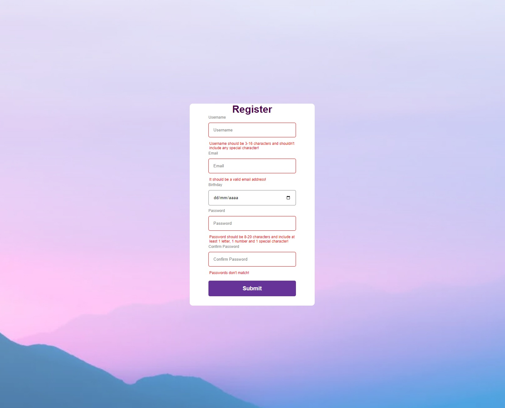

# React Form Basic

## Description
Form without libraries

## STACK
- HTML5
- CSS3
- JavaScript
- ReactJs

## Installation

Clone the project https://github.com/JesusLeonChavez/react-form-basic.git

```bash
  git clone https://github.com/JesusLeonChavez/react-form-basic.git
```

Installation

```bash
  npm i
```

Start Client

```bash
  npm start
```

## Public Routes
Accessible Routes:

* Home



## References

[Lama Dev](https://www.youtube.com/c/LamaDev)
